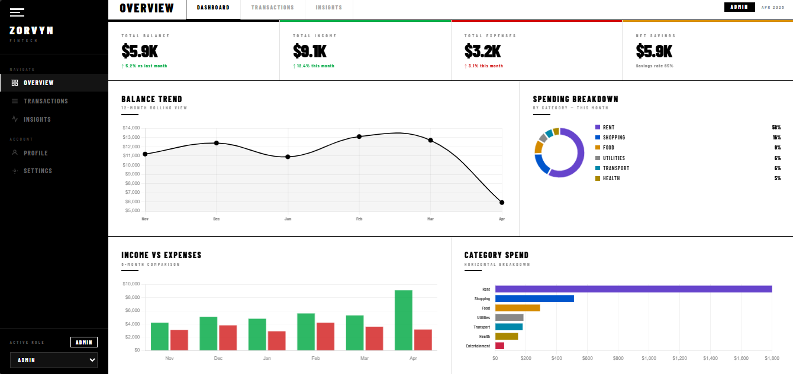
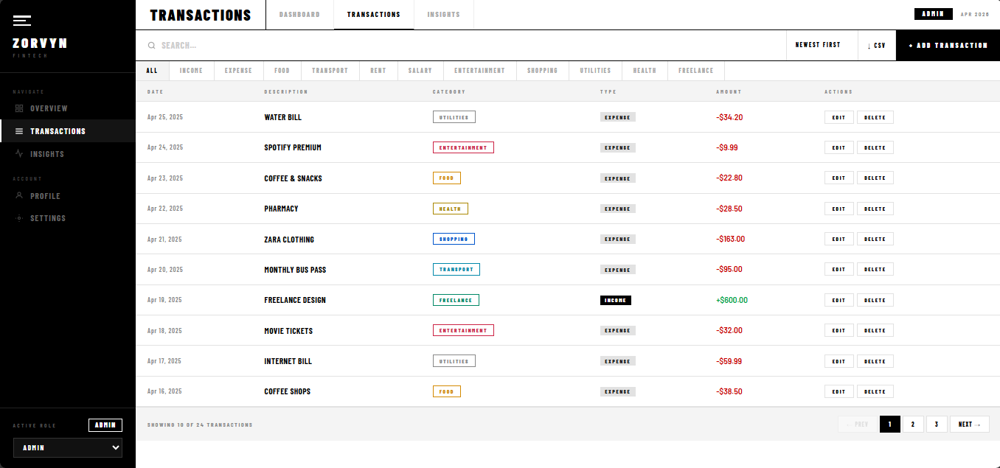
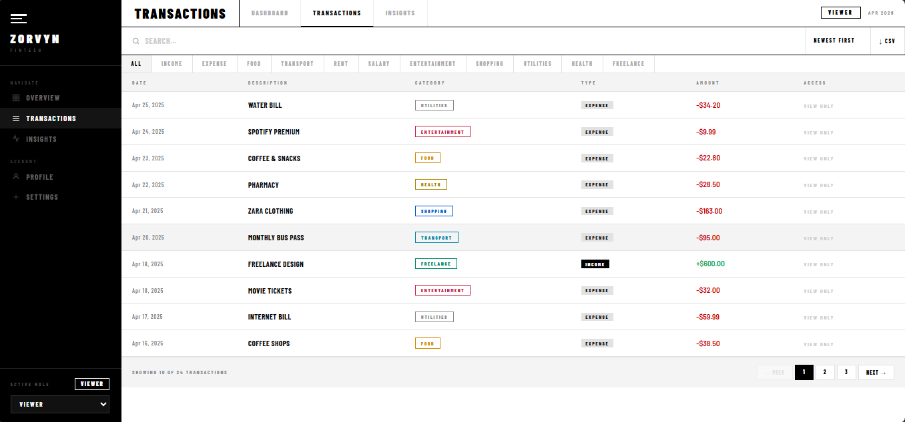
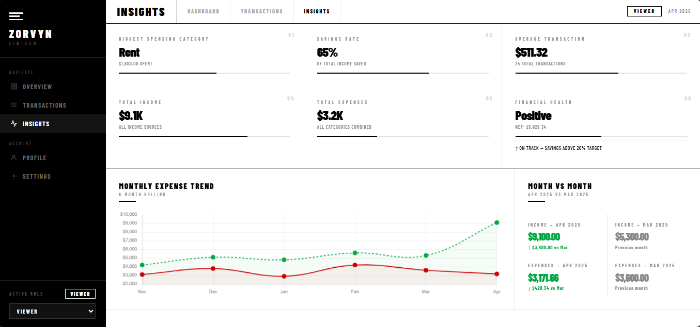

# Zorvyn Finance Dashboard 📊

Welcome to the *Zorvyn Finance Dashboard*! This is a clean and interactive frontend project designed to help users track, manage, and understand their financial activity. Built using HTML, CSS, and JavaScript, the focus is on intuitive UI, smooth interactions, and meaningful data visualization.


---

# 🛠️ Setup Instructions

Follow these steps to run the project locally:

### Prerequisites
- A modern web browser (Chrome recommended)

### Steps
1. Clone this repository:
   ```bash
   git clone https://github.com/Shivakashyap16/zorvyn-finance-dashboard.git
   ```

2. Navigate to the project folder:
   ```bash
   cd zorvyn-finance-dashboard
   ```

3. Open the file:
   ```
   zorvyn_fintech_dashboard.html
   ```

4. Run it in your browser  
   (Double-click the file or use Live Server)

---

# 🖼️ Dashboard UI



---

# 💳 Transactions Section

🔐 Role-Based Access (Admin vs Viewer)

 


---

# 📈 Insights Section



---

# ✨ Features

### 📊 Dashboard Overview
- Summary cards: Balance, Income, Expenses, Savings  
- Line chart for balance trend  
- Donut chart for spending breakdown  
- Bar charts for comparisons  

### 💳 Transactions Management
- View all transactions in a table  
- Search, filter, and sort data  
- Pagination for better readability  
- Add, edit, delete transactions (Admin only)  
- Export data as CSV  

### 🔐 Role-Based UI
- Admin: Full access (Add, Edit, Delete)  
- Viewer: Read-only access  
- Role switching via dropdown  

### 📈 Insights
- Highest spending category  
- Savings rate and financial health  
- Average transaction value  
- Monthly comparison and trends  
- Smart observations based on data  

### 💾 State Management
- Centralized state object for:
  - Transactions  
  - Filters and search  
  - Role and navigation  
- Data persistence using LocalStorage  

---

# 🧠 Approach

This project follows a simplicity-first approach. The goal was to design a dashboard that is easy to understand and interact with, without unnecessary complexity.

- Used vanilla JavaScript to demonstrate strong frontend fundamentals  
- Managed application state using a centralized object  
- Focused on clean UI, readability, and responsiveness  
- Added small interactions (animations, toasts) to improve user experience  


---

# 🔧 Customization

- Update styles in CSS to change UI appearance  
- Extend with features like dark mode or API integration  


